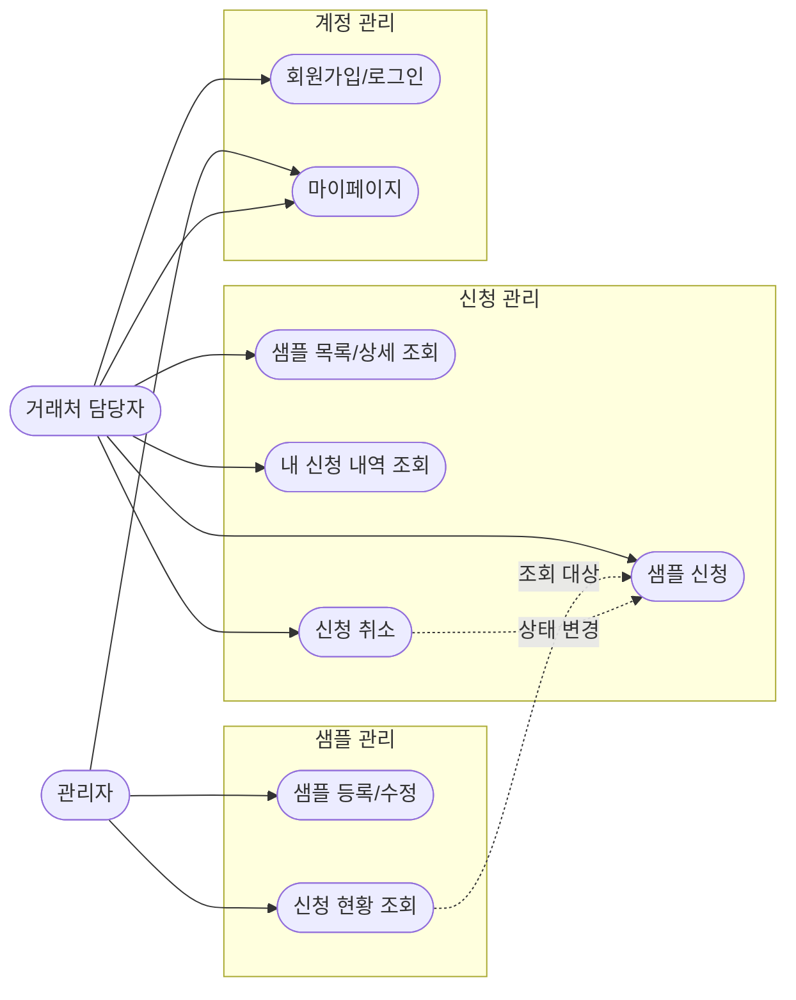

# 유스케이스 다이어그램

`1-domain-definition.md`의 2.역할(Actor), 3.핵심 엔티티, 4.주요 유스케이스를 바탕으로 작성함.

```mermaid
flowchart LR
    Admin(["관리자"])
    Buyer(["거래처 담당자"])

    subgraph Sample["샘플 관리"]
        UC1(["샘플 등록/수정"])
        UC2(["신청 현황 조회"])
    end

    subgraph Application["신청 관리"]
        UC4(["샘플 목록/상세 조회"])
        UC5(["샘플 신청"])
        UC6(["내 신청 내역 조회"])
        UC7(["신청 취소"])
    end

    subgraph User["계정 관리"]
        UC3(["회원가입/로그인"])
        UC8(["마이페이지"])
    end

    Admin --> UC1
    Admin --> UC2
    Admin --> UC8

    Buyer --> UC3
    Buyer --> UC4
    Buyer --> UC5
    Buyer --> UC6
    Buyer --> UC7
    Buyer --> UC8

    UC2 -.조회 대상.-> UC5
    UC7 -.상태 변경.-> UC5
```
