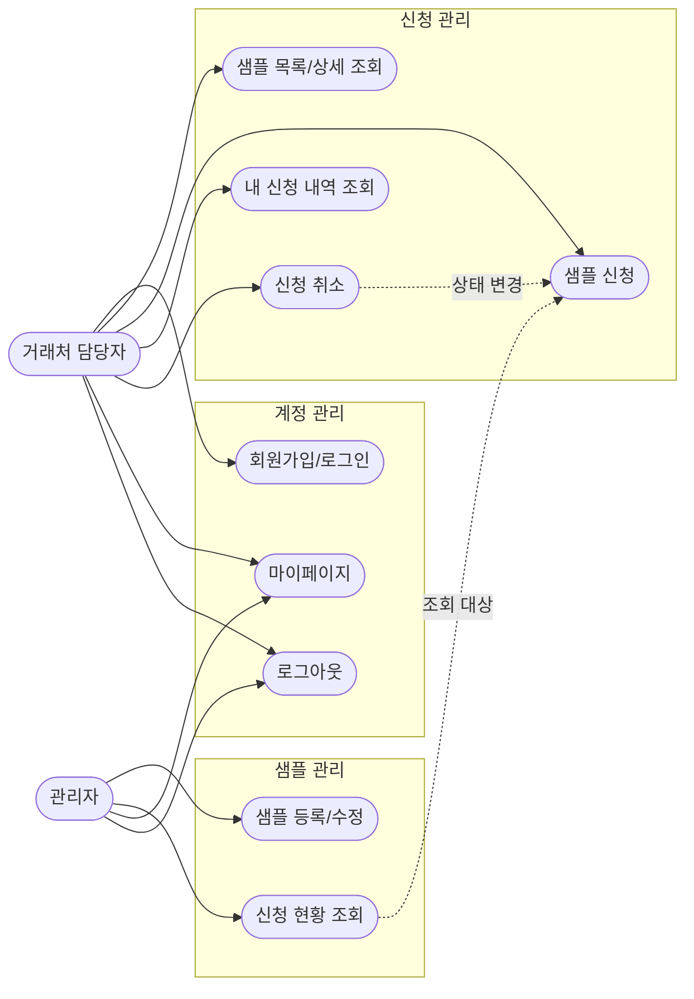

# 유스케이스 다이어그램

## 변경 이력

| 버전 | 날짜 | 변경 내용 |
|---|---|---|
| 0.1 | 2026-08-13 | 최초 작성 |
| 0.2 | 2026-08-21 | 로그아웃 유스케이스(UC9) 추가. 일일 신청 가능 개수 룰렛은 원 도메인 밖 부가 기능이라 이 다이어그램에는 포함하지 않음(`1-domain-definition.md` 6-1절 참고) |

`1-domain-definition.md`의 2.역할(Actor), 3.핵심 엔티티, 4.주요 유스케이스를 바탕으로 작성함.

