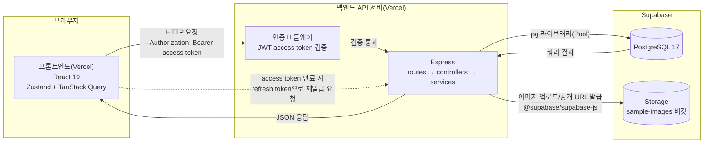
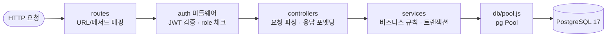
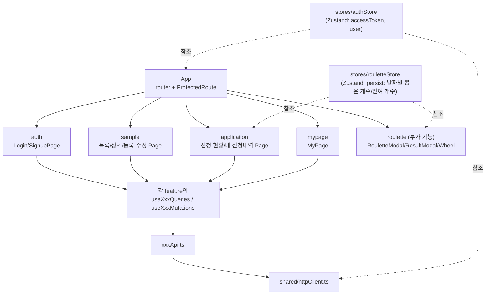

# 기술 아키텍처 다이어그램

## 변경 이력

| 버전 | 날짜 | 변경 내용 |
|---|---|---|
| 0.1 | 2026-08-13 | 최초 작성 |
| 0.2 | 2026-08-13 | 백엔드 요청 처리 계층 흐름 다이어그램 추가 |
| 0.3 | 2026-08-13 | "전체 시스템 구성도" 섹션 제목 추가 |
| 0.4 | 2026-08-13 | 프론트엔드 컴포넌트 구조 다이어그램 추가 |
| 0.5 | 2026-08-21 | 실제 배포 환경(Vercel, Supabase) 반영해 전체 시스템 구성도 갱신 — 프론트엔드/백엔드는 Vercel에, DB와 샘플 이미지 저장은 Supabase(Postgres + Storage)를 사용함. 프론트엔드 컴포넌트 구조에 `roulette` feature와 `rouletteStore` 추가 |

## 전체 시스템 구성도

브라우저(React 19 SPA) - 백엔드 API 서버(Express) - PostgreSQL DB로 이어지는 3단 구조다. 인증은 로그인 시 발급된 access/refresh token을 브라우저가 보관하고, API 요청마다 Express의 인증 미들웨어가 access token을 검증하며, access token 만료 시 refresh token으로 재발급받는다.

프론트엔드와 백엔드는 각각 별도의 Vercel 프로젝트로 배포되고, DB와 샘플 이미지 파일 저장은 Supabase(PostgreSQL 17 + Storage)를 사용한다. 이 두 가지(Vercel, Supabase)는 실제로 쓰는 배포/운영 인프라라 포함하며, 그 외 컨테이너 오케스트레이션·CDN·로드밸런서·API 게이트웨이 등 별도로 구축하지 않은 요소는 포함하지 않는다.

## 백엔드 요청 처리 계층 흐름

API 서버 내부는 `routes → controllers → services → db(pool)` 4단 계층으로만 구성한다(`5-project-principle.md` 2절 기준). 계층 간 역방향 호출은 없다.

## 프론트엔드 컴포넌트 구조

`frontend/src` 하위 구조를 따른다(`5-project-principle.md` 6절 기준). Page 컴포넌트가 기능별 쿼리/뮤테이션 훅을 호출하고, 훅은 API 클라이언트를 거쳐 백엔드와 통신한다. 인증 상태(Zustand)는 공용으로 참조된다.

