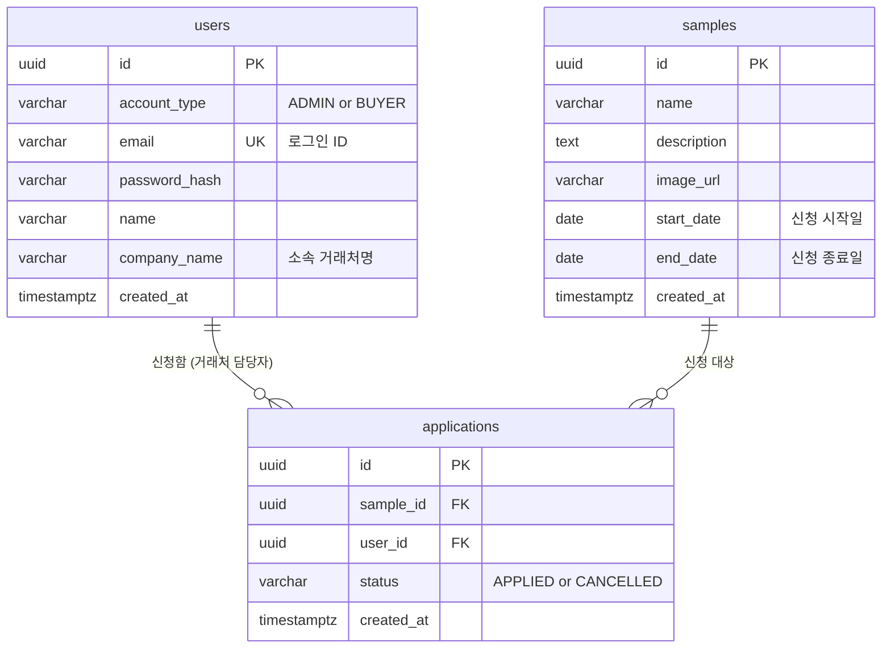

# ERD (Entity-Relationship Diagram)

## 변경 이력

| 버전 | 날짜 | 변경 내용 |
|---|---|---|
| 0.1 | 2026-08-13 | 최초 작성 |

## 1. 다이어그램

- `applications`는 (`sample_id`, `user_id`) 조합에 UNIQUE 제약을 두어, 하나의 샘플-담당자 조합당 신청 레코드가 항상 하나만 존재하도록 한다.

## 2. 테이블 상세

### users

| 컬럼명 | 타입 | 제약조건 | 설명 |
|---|---|---|---|
| id | uuid | PK | 사용자 ID |
| account_type | varchar | NOT NULL | 계정 유형 (ADMIN / BUYER) |
| email | varchar | NOT NULL, UNIQUE | 로그인 ID |
| password_hash | varchar | NOT NULL | 해시된 비밀번호 |
| name | varchar | NOT NULL | 이름 |
| company_name | varchar | NULL 허용 | 소속 거래처명 (관리자는 없을 수 있음) |
| created_at | timestamptz | NOT NULL, DEFAULT now() | 생성일시 |

### samples

| 컬럼명 | 타입 | 제약조건 | 설명 |
|---|---|---|---|
| id | uuid | PK | 샘플 ID |
| name | varchar | NOT NULL | 샘플명 |
| description | text | NULL 허용 | 상품 설명 |
| image_url | varchar | NULL 허용 | 이미지 경로/URL |
| start_date | date | NOT NULL | 신청 시작일 |
| end_date | date | NOT NULL | 신청 종료일 |
| created_at | timestamptz | NOT NULL, DEFAULT now() | 생성일시 |

### applications

| 컬럼명 | 타입 | 제약조건 | 설명 |
|---|---|---|---|
| id | uuid | PK | 신청 ID |
| sample_id | uuid | FK → samples.id, NOT NULL | 신청 대상 샘플 |
| user_id | uuid | FK → users.id, NOT NULL | 신청한 거래처 담당자 |
| status | varchar | NOT NULL, DEFAULT 'APPLIED' | 신청 상태 (APPLIED / CANCELLED) |
| created_at | timestamptz | NOT NULL, DEFAULT now() | 생성일시 |
| | | UNIQUE (sample_id, user_id) | 샘플-담당자 조합당 신청 레코드 유일 |
