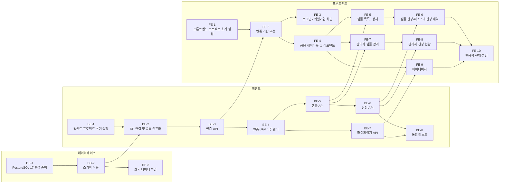

# 실행 계획

## 변경 이력

| 버전 | 날짜 | 변경 내용 |
|---|---|---|
| 0.1 | 2026-08-13 | 최초 작성 |
| 0.2 | 2026-08-13 | 의존 관계 다이어그램에 Task 명칭 표기 및 레이어별 그룹화 |
| 0.3 | 2026-08-13 | BE-6/BE-7 엔드포인트 서술을 swagger.json 기준으로 구체화(PATCH /applications/:id, PUT /users/me/password) |
| 0.4 | 2026-08-13 | DB-1 완료 조건 체크 (b2b_promo DB 생성, DATABASE_URL 접속 확인) |
| 0.5 | 2026-08-13 | DB-2 완료 조건 체크 (테이블/제약 생성 확인, migrations 파일 배치, UNIQUE 위반 테스트) |
| 0.6 | 2026-08-13 | DB-3 완료 조건 체크 (관리자 계정, 신청 예정/가능/종료 샘플 각 1건 삽입) |
| 0.7 | 2026-08-13 | BE-1 완료 조건 체크 (Express 초기 설정, env 검증, /health, 테스트 9개 통과) |
| 0.8 | 2026-08-13 | BE-2 완료 조건 체크 (DB 연결 확인, AppError/errorHandler, 테스트 14개 통과) |
| 0.9 | 2026-08-13 | BE-3 완료 조건 체크 (회원가입/로그인/refresh API, 테스트 21개 통과) |
| 0.10 | 2026-08-13 | BE-4 완료 조건 체크 (auth/requireRole 미들웨어, 테스트 29개 통과) |
| 0.11 | 2026-08-13 | BE-5 완료 조건 체크 (샘플 목록/상세/등록/수정 API, 테스트 40개 통과) |
| 0.12 | 2026-08-13 | BE-6 완료 조건 체크 (신청/취소/재신청, 관리자 신청현황 API, 테스트 54개 통과) |
| 0.13 | 2026-08-13 | BE-7 완료 조건 체크 (마이페이지 조회/수정/비밀번호 변경 API, 테스트 60개 통과) |
| 0.14 | 2026-08-21 | BE-8 완료 조건 체크 (backend/tests/ 통합 테스트 구현 확인 — applications 비즈니스 규칙 4종, 회원가입/로그인/샘플/마이페이지 happy path, `npm test` 단일 명령 실행) |
| 0.15 | 2026-08-21 | FE-1 완료 조건 체크 (Vite+React19+Zustand+TanStack Query 초기 설정, 개발 서버 기동/렌더링 확인, 테스트 3개 통과) |
| 0.16 | 2026-08-21 | FE-2 완료 조건 체크 (authStore/httpClient/ProtectedRoute, refresh 재시도 로직 access_token 표기 버그 수정, 테스트 13개 통과) |
| 0.17 | 2026-08-21 | FE-3 완료 조건 3개 체크 (LoginPage/SignupPage/authApi/useAuthMutations, 테스트 18개 통과). 반응형 배치 조건은 브라우저 시각 검증 미완료로 미체크 |
| 0.18 | 2026-08-21 | FE-4 완료 조건 2개 체크 (공용 컴포넌트/레이아웃/types.ts, feature 간 import 없음 확인, 테스트 31개 통과). 반응형 네비게이션 배치 조건은 브라우저 시각 검증 미완료로 미체크 |
| 0.19 | 2026-08-21 | FE-5 완료 조건 2개 체크 (샘플 목록/상세 화면, sampleApi/useSampleQueries, 테스트 35개 통과). 반응형 그리드/2단 배치 조건은 브라우저 시각 검증 미완료로 미체크 |
| 0.20 | 2026-08-21 | FE-6 완료 조건 5개 모두 체크 (신청/취소/재신청, MyApplicationsPage, 부분 쿼리 무효화 확인, 테스트 44개 통과, 테스트 파일 타입 에러 수정) |
| 0.21 | 2026-08-21 | FE-7~FE-9 구현 완료 (SampleAdminListPage/SampleFormPage, ApplicationStatusPage, MyPage). 완료 조건 중 반응형(모바일 카드/데스크탑 표·2단 배치)과 "비밀번호 변경 후 재로그인" 통합 시나리오는 브라우저/실서버 확인이 필요해 미체크. 테스트 59개 전부 통과, 빌드 정상 |
| 0.22 | 2026-08-21 | FE-10 반응형 정적 점검: `MyPage.tsx`가 레이아웃(BuyerLayout/AdminLayout) 없이 단독 라우트라 `.container`(최대폭 1200px+패딩)가 빠져 있던 버그 수정. index.css의 `@media (min-width:768px)` 규칙으로 목록형 화면(표/그리드 전환), 상세·폼·마이페이지(2단 배치 전환)이 모두 구현돼 있음을 확인해 2개 조건 체크. "모바일 폭 가로 스크롤 없음"은 고정폭 요소·overflow 위험을 코드 상으로는 찾지 못했으나 실제 브라우저 렌더링 확인이 불가능해(playwright/chrome-devtools MCP 미연결) 미체크로 남김 |
| 0.23 | 2026-08-21 | FE-10 실제 브라우저(Playwright, chromium headless) 검증 완료: 360px/1280px에서 8개 화면 전체 `scrollWidth === clientWidth` 확인해 마지막 조건도 체크(3개 전 조건 완료). 검증 중 실버그 2건 발견 및 수정 — (1) `.nav-inner`가 `height: 56px` 고정이라 모바일에서 nav-links 3개가 세로로 쌓이며 겹쳐 보이던 문제(BuyerLayout/AdminLayout 공통) → 모바일은 `flex-direction: column`+`height: auto`, 데스크탑만 `height: 56px` 가로 배치로 분리, (2) `SampleFormPage.tsx` 수정 모드에서 백엔드가 `start_date`/`end_date`를 전체 ISO 타임스탬프로 내려줘 `<input type="date">`에 프리필되지 않던 문제 → `.slice(0, 10)`으로 날짜부분만 사용하도록 수정. 테스트 59개 전부 통과, 빌드 정상. (참고, FE-10 범위 밖: 목록/상세 화면에 날짜가 `2026-08-09T15:00:00.000Z` 형태의 원본 ISO 문자열로 표시되고 있어 와이어프레임의 `08.01 ~ 08.20` 표기와 다름 — 별도 날짜 포맷팅 작업 필요, 이번 태스크에서는 손대지 않음) |
| 0.24 | 2026-08-21 | FE-7 사후 개선: 샘플 이미지를 URL 텍스트 입력에서 실제 파일 첨부로 변경(원래 `7-wireframe.md` 8-2절 의도와 일치). 백엔드에 `POST /uploads`(관리자 전용, multer로 `backend/uploads/`에 로컬 저장, 정적 서빙) 신규 추가하고 swagger.json에 문서화. 프론트는 `<input type="file">` + 업로드 후 반환된 url을 image_url로 저장, 목록/상세 화면은 상대경로를 백엔드 origin으로 resolve해서 표시. 백엔드 테스트 5개 추가(총 74개 통과), 프론트 테스트 1개 추가(총 60개 통과), 실제 브라우저로 업로드→저장→목록 표시까지 end-to-end 확인 |
| 0.25 | 2026-08-21 | FE-4 사후 개선: BuyerLayout/AdminLayout 네비게이션에 로그아웃 버튼이 없던 문제 발견 및 수정. 공용 `shared/components/LogoutButton.tsx` 추가(authStore.logout() 호출 후 /login으로 이동), 두 레이아웃 nav에 배치. 레이아웃 테스트 2개 추가(총 62개 통과), 실제 브라우저로 로그아웃→로그인 화면 이동 확인 |
| 0.26 | 2026-08-21 | 사용자 리포트로 발견된 반응형 회귀 버그 수정: `container nav-inner`로 클래스를 함께 쓰는 nav 헤더에서 `.nav-inner`의 `padding` shorthand(모바일 `12px 0`, 데스크탑 `0`)가 `.container`의 좌우 16px 패딩을 완전히 덮어써 로고/링크 텍스트가 화면 왼쪽 끝에 그대로 붙는 문제(FE-10 나비게이션 겹침 수정(0.23) 당시 도입됨). `padding-top`/`padding-bottom`만 지정하도록 수정해 `.container`의 좌우 패딩을 보존. Playwright로 360~1280px 전 폭에서 로고 요소의 left 좌표가 16px로 정상 유지되는지, 그리고 로그인/회원가입/샘플 목록·상세/내 신청 내역/마이페이지/관리자 화면 전체(모바일 390px, 데스크탑 1280px)에서 동일한 좌측 패딩 소실이 없는지 재점검함. 테스트 62개 통과, 빌드 정상 |
| 0.27 | 2026-08-21 | 운영(Supabase) DB에 `docs/8-schema.sql` 적용, `users`/`samples`/`applications` 생성 및 컬럼 검증 완료. `JWT_ACCESS_SECRET`/`JWT_REFRESH_SECRET` placeholder를 랜덤 값으로 교체 |
| 0.28 | 2026-08-21 | 배포된 백엔드(`https://b2b-promo.vercel.app`)에 대해 API 레벨 E2E 테스트 수행(`e2e/run_e2e_prod_api.js`). 30개 시나리오 중 29개 통과, 이미지 업로드는 500 에러로 실패 — Vercel 서버리스 함수는 배포 코드 디렉터리가 읽기 전용이라 `multer.diskStorage()`가 로컬 디스크(`backend/uploads/`)에 쓰지 못하는 것이 원인(로컬 개발 서버에서만 통과했던 이유). 로컬 테스트 통과가 서버리스 배포 환경 동작을 보장하지 않음을 실제로 확인 |
| 0.29 | 2026-08-21 | 샘플 이미지 업로드를 로컬 디스크 저장에서 Supabase Storage로 교체: `sample-images` public 버킷 신설, `backend`에 `@supabase/supabase-js` 추가, `multer.diskStorage()` → `multer.memoryStorage()` + `uploads.service.js`(버퍼를 버킷에 업로드하고 공개 URL 반환)로 교체. `express.static('/uploads')` 및 로컬 `backend/uploads/` 디렉터리 제거(더 이상 필요 없음). `SUPABASE_URL`/`SUPABASE_SERVICE_ROLE_KEY`/`SUPABASE_STORAGE_BUCKET`을 필수 환경변수로 추가(`.env`/`.env.example`/`.env.production`). 로컬 테스트 77개(신규 업로드 테스트 5개 포함) 통과, 버킷에 테스트 파일 잔존 없음 확인. **배포된 백엔드는 아직 이 변경으로 재배포되지 않았고, Vercel 프로젝트 환경변수에 Supabase 자격증명이 추가되지 않아 운영 환경에서는 아직 반영되지 않음** — 재배포 및 Vercel 환경변수 설정 필요 |
| 0.30 | 2026-08-21 | Vercel 환경변수(`SUPABASE_URL`/`SUPABASE_SERVICE_ROLE_KEY`/`SUPABASE_STORAGE_BUCKET`) 추가 및 재배포 후 운영 백엔드 E2E 30개 시나리오 전체 재검증(`e2e/run_e2e_prod_api.js`) — 이미지 업로드 포함 30/30 PASS. 최초 재검증 시 업로드 스텝이 실패했으나 원인은 실제 버그가 아니라 테스트 스크립트가 절대 URL 앞에 `BASE`를 중복으로 붙이던 버그였음(응답이 상대경로였던 이전 로컬 디스크 방식 기준으로 작성된 코드가 남아 있었음) — 스크립트 수정 후 재확인. 스토리지 정리 로직도 추가해 테스트가 만든 파일이 버킷에 남지 않도록 함 |
| 0.31 | 2026-08-21 | 보안 정리: `e2e/run_e2e_prod_api.js`에 운영 DB 접속 문자열과 Supabase service_role 키가 평문으로 하드코딩된 채 커밋 731d02d에 이미 푸시된 것을 발견. 자격증명을 하드코딩 대신 `e2e/.env`(gitignore 대상, `.env.example`로 형식만 공유)에서 읽도록 스크립트 수정, `DATABASE_URL`이 없으면 즉시 에러로 안내. 사용자 판단에 따라 노출된 키 자체는 회전하지 않고 그대로 유지하기로 결정했고, git 히스토리도 재작성(force-push)하지 않고 그대로 두기로 함 — 이후 이 값을 다시 코드에 하드코딩하지 않도록 주의 필요 |
| 0.32 | 2026-08-21 | `frontend/vercel.json` SPA fallback rewrite 추가(react-router 클라이언트 라우팅 경로 직접 접속/새로고침 시 404 방지) — 처음 만들 때 커밋을 안 해서 배포에 반영이 안 됐던 것을 뒤늦게 발견해 커밋·푸시. 프론트엔드(`https://b2b-promo-pfey.vercel.app`) 배포 후 실제 브라우저 E2E(`e2e/run_e2e_prod_browser.py`, 32개 시나리오) 수행 중 배포 환경에서만 드러나는 실제 버그 2건 발견 및 수정: (1) 백엔드 `FRONTEND_ORIGIN`이 placeholder로 남아 있어 실제 프론트엔드 요청이 CORS로 전부 차단됨 → Vercel 환경변수 수정, (2) `httpClient.ts`가 `VITE_API_BASE_URL`을 읽지 않고 `localhost:3000`으로 하드코딩되어 있어 배포된 프론트엔드가 자기 자신의 로컬호스트를 호출하려다 실패(`Failed to fetch`) → `import.meta.env.VITE_API_BASE_URL`을 읽도록 수정, 빌드 결과물에 실제 백엔드 주소가 박히는지 확인 후 재배포. 두 문제 모두 로컬 환경에서는 드러나지 않는 배포 전용 이슈였음. 이후 32/32 PASS, 테스트 계정/데이터 정리 완료, 실제 가입 사용자(`hdhong@gmail.com`) 데이터는 보존 |

## 1. 개요

`1-domain-definition.md` ~ `8-schema.sql`에서 정의한 요구사항을 데이터베이스 / 백엔드 / 프론트엔드 단위의 독립 Task로 분해한 실행 계획이다. PRD 7절 기준으로 3일·1인 개발을 전제로 하며, MVP 제외 범위(승인 워크플로우, 재고, 검색, 결제 등)에 해당하는 Task는 포함하지 않는다.

- Task ID 규칙: `DB-n`(데이터베이스), `BE-n`(백엔드), `FE-n`(프론트엔드)
- 각 Task는 선행 Task가 끝나면 독립적으로 착수 가능하다.
- 완료 조건의 체크박스가 모두 채워져야 해당 Task를 완료로 본다.

## 2. Task 의존 관계 요약

## 3. 데이터베이스 Task

### DB-1. PostgreSQL 17 환경 준비

- **선행 Task**: 없음
- **작업 내용**
  - PostgreSQL 17 설치 또는 기존 인스턴스 확보
  - 프로젝트 전용 데이터베이스와 접속 계정 생성
  - `DATABASE_URL` 접속 문자열 확정 (`5-project-principle.md` 5절 기준)
- **완료 조건**
  - [x] PostgreSQL 17 인스턴스에 접속 가능하다
  - [x] 프로젝트 전용 데이터베이스가 생성되어 있다
  - [x] `DATABASE_URL` 형태의 접속 문자열로 psql 접속이 성공한다

### DB-2. 스키마 적용

- **선행 Task**: DB-1
- **작업 내용**
  - `docs/8-schema.sql`을 대상 데이터베이스에 실행
  - `backend/src/db/migrations/` 아래에 동일 DDL을 순번 파일로 배치(`5-project-principle.md` 7절 구조)
- **완료 조건**
  - [x] `users`, `samples`, `applications` 3개 테이블이 생성되어 있다
  - [x] `users.email` UNIQUE, `applications (sample_id, user_id)` UNIQUE 제약이 존재한다
  - [x] `account_type`, `status` CHECK 제약과 `end_date >= start_date` CHECK 제약이 존재한다
  - [x] 동일 `(sample_id, user_id)`로 INSERT를 2회 시도하면 두 번째가 UNIQUE 위반으로 실패한다

### DB-3. 초기 데이터 투입

- **선행 Task**: DB-2
- **작업 내용**
  - 관리자 계정 1건 삽입(비밀번호는 해시값으로 저장)
  - 화면 확인용 샘플 데이터 3건 삽입 — 신청 예정(시작일 미래), 신청 가능(기간 내), 신청 종료(종료일 과거) 각 1건
- **완료 조건**
  - [x] `account_type = 'ADMIN'`인 사용자 1건이 존재한다
  - [x] `password_hash` 컬럼에 평문이 아닌 해시값이 저장되어 있다
  - [x] 신청 예정 / 신청 가능 / 신청 종료 상태로 판정되는 샘플이 각 1건 이상 존재한다

## 4. 백엔드 Task

### BE-1. 백엔드 프로젝트 초기 설정

- **선행 Task**: 없음
- **작업 내용**
  - `backend/` 디렉토리를 `5-project-principle.md` 7절 구조로 생성
  - Express, pg, jsonwebtoken, bcrypt(또는 crypto.scrypt) 의존성 설치
  - `config/env.js` 작성 — `DATABASE_URL`, `JWT_ACCESS_SECRET`, `JWT_REFRESH_SECRET`, `JWT_ACCESS_EXPIRES_IN`, `JWT_REFRESH_EXPIRES_IN`, `PORT` 검증
  - `.env.example` 커밋, `.env`는 `.gitignore` 처리
- **완료 조건**
  - [x] `npm start`로 서버가 기동되고 지정 포트에서 응답한다
  - [x] 필수 환경변수를 하나 비우고 기동하면 즉시 종료된다
  - [x] `.env`가 git에 추적되지 않고 `.env.example`만 커밋되어 있다

### BE-2. DB 연결 및 공통 인프라

- **선행 Task**: BE-1, DB-2
- **작업 내용**
  - `db/pool.js`에 pg Pool 인스턴스 1개 생성
  - `utils/AppError.js`, `utils/asyncHandler.js` 작성
  - `middlewares/errorHandler.js`로 공통 에러 응답 포맷 정의
  - CORS를 프론트 개발 서버 origin으로만 허용
- **완료 조건**
  - [x] 서버 기동 시 DB 연결이 성공한다
  - [x] 임의의 라우트에서 `AppError`를 던지면 지정한 상태코드와 메시지 형태로 응답한다
  - [x] 프론트 개발 서버 origin에서 호출 시 CORS 오류가 발생하지 않는다

### BE-3. 인증 API

- **선행 Task**: BE-2
- **작업 내용**
  - `POST /auth/signup` — 거래처 담당자 자가 회원가입(이메일, 비밀번호, 이름, 소속 거래처명)
  - `POST /auth/login` — 이메일/비밀번호 검증 후 access/refresh token 발급
  - `POST /auth/refresh` — refresh token으로 access token 재발급
  - 비밀번호는 해시로 저장, 응답에 절대 포함하지 않음
- **완료 조건**
  - [x] 회원가입한 계정의 `password_hash`가 평문이 아니다
  - [x] 중복 이메일로 회원가입하면 실패 응답을 반환한다
  - [x] 로그인 성공 시 access token과 refresh token이 모두 반환된다
  - [x] 만료되거나 위조된 refresh token으로 재발급을 시도하면 실패한다
  - [x] 어떤 인증 응답에도 비밀번호(평문/해시)가 포함되지 않는다

### BE-4. 인증·권한 미들웨어

- **선행 Task**: BE-3
- **작업 내용**
  - `middlewares/auth.js` — Authorization 헤더의 access token 검증 후 `req.user` 설정
  - `middlewares/requireRole.js` — `ADMIN` / `BUYER` 역할 체크
  - 인증이 필요한 모든 라우트에 미들웨어 적용
- **완료 조건**
  - [x] 토큰 없이 보호된 엔드포인트 호출 시 401을 반환한다
  - [x] 만료된 access token으로 호출 시 401을 반환한다
  - [x] BUYER 토큰으로 관리자 전용 엔드포인트 호출 시 403을 반환한다

### BE-5. 샘플 API

- **선행 Task**: BE-4
- **작업 내용**
  - `GET /samples` — 목록 조회(`end_date >= CURRENT_DATE` 필터, 신청 예정/진행중 포함)
  - `GET /samples/:id` — 상세 조회
  - `POST /samples`, `PUT /samples/:id` — 관리자 전용 등록/수정
  - 예정/진행중/종료 상태는 저장하지 않고 `start_date`/`end_date`와 현재 날짜 비교로 계산해 응답에 포함
- **완료 조건**
  - [x] 관리자가 샘플을 등록하면 목록에 반영된다
  - [x] BUYER 토큰으로 샘플 등록/수정을 시도하면 403을 반환한다
  - [x] 목록 응답에 신청 종료된 샘플이 포함되지 않는다
  - [x] 응답의 샘플 상태가 날짜 기준으로 예정/진행중이 올바르게 계산된다
  - [x] `samples` 테이블에 상태 저장용 컬럼을 추가하지 않았다

### BE-6. 신청 API

- **선행 Task**: BE-4, BE-5
- **작업 내용**
  - `POST /applications` — 신청/재신청. `INSERT ... ON CONFLICT (sample_id, user_id) DO UPDATE SET status='APPLIED' WHERE applications.status='CANCELLED'` 단일 UPSERT로 처리
  - `PATCH /applications/:id` — 상태를 `CANCELLED`로 변경(삭제 금지)
  - `GET /applications/me` — 본인 신청 내역 조회
  - `GET /samples/:id/applications` — 관리자 전용 샘플별 신청 현황
  - 신청 시점에 `start_date <= today <= end_date`를 서버에서 재검증
- **완료 조건**
  - [x] 동일 사용자가 동일 샘플을 재신청하면 "이미 신청한 샘플입니다." 메시지를 반환한다
  - [x] 중복 신청 시도 후에도 해당 조합의 `applications` 레코드 수가 1건으로 유지된다
  - [x] 취소 후 레코드가 삭제되지 않고 `status`만 `CANCELLED`로 바뀐다
  - [x] 취소한 샘플을 기간 내 재신청하면 같은 레코드의 `status`가 `APPLIED`로 되돌아간다(레코드 id 동일)
  - [x] 신청 시작일 이전 샘플에 신청하면 거부된다
  - [x] 신청 종료일 당일에는 신청이 성공하고, 다음 날에는 신규 신청·재신청이 모두 거부된다
  - [x] 관리자 신청 현황 응답에 신청/취소 상태가 모두 조회된다

### BE-7. 마이페이지 API

- **선행 Task**: BE-4
- **작업 내용**
  - `GET /users/me` — 내 정보 조회
  - `PUT /users/me` — 이름, 소속 거래처명 수정
  - `PUT /users/me/password` — 새 비밀번호를 해시로 저장
  - 관리자·거래처 담당자 공통 사용
- **완료 조건**
  - [x] 내 정보 조회 응답에 비밀번호 관련 필드가 포함되지 않는다
  - [x] 이름/소속 거래처명 수정 결과가 DB에 반영된다
  - [x] 비밀번호 변경 후 기존 비밀번호로는 로그인되지 않고 새 비밀번호로 로그인된다
  - [x] 관리자와 거래처 담당자 토큰 모두에서 동작한다

### BE-8. 통합 테스트

- **선행 Task**: BE-6, BE-7
- **작업 내용**
  - supertest 기반 API 통합 테스트 작성(`tests/` 하위)
  - `applications` 비즈니스 규칙 중심으로 작성: 중복 신청, 취소→재신청, 시작 전/종료 후 거부
  - 나머지(회원가입/로그인/샘플 CRUD/마이페이지)는 happy path 1건씩
  - 단위 테스트·E2E는 작성하지 않음
- **완료 조건**
  - [x] 중복 신청 / 취소→재신청 / 시작 전 신청 / 종료 후 신청 4개 케이스 테스트가 존재하고 통과한다
  - [x] 회원가입, 로그인, 샘플 등록, 마이페이지 수정의 happy path 테스트가 통과한다
  - [x] 전체 테스트가 한 번의 명령으로 실행된다

## 5. 프론트엔드 Task

### FE-1. 프론트엔드 프로젝트 초기 설정

- **선행 Task**: 없음
- **작업 내용**
  - `frontend/` 생성, React 19 + Zustand + TanStack Query 설치
  - `5-project-principle.md` 6절 디렉토리 구조 골격 생성
  - `app/router.tsx`, `app/queryClient.ts` 설정
  - `index.css`에 768px breakpoint 기준 반응형 기본 스타일 정의(`7-wireframe.md` 2절)
- **완료 조건**
  - [x] 개발 서버가 기동되고 기본 라우트가 렌더링된다
  - [x] `frontend/src` 하위가 문서에 정의된 디렉토리 구조를 따른다
  - [x] 768px 기준 breakpoint가 스타일에 정의되어 있다

### FE-2. 인증 기반 구성

- **선행 Task**: FE-1, BE-3
- **작업 내용**
  - `stores/authStore.ts` — accessToken, user(role), login/logout 액션
  - `shared/httpClient.ts` — Authorization 헤더 자동 첨부, 401 시 refresh token으로 재발급 후 재시도
  - `app/ProtectedRoute.tsx` — 미인증 시 로그인 화면으로 리다이렉트, 역할별 라우트 분기
- **완료 조건**
  - [x] 로그인 성공 시 토큰이 `authStore`에 저장된다
  - [x] 보호된 경로에 미인증 상태로 접근하면 로그인 화면으로 이동한다
  - [x] access token 만료 시 refresh로 자동 재발급되어 요청이 재시도된다
  - [x] 컴포넌트가 토큰을 직접 다루지 않고 httpClient/authStore를 통해서만 접근한다

### FE-3. 로그인 / 회원가입 화면

- **선행 Task**: FE-2
- **작업 내용**
  - `LoginPage.tsx`, `SignupPage.tsx` 구현(`7-wireframe.md` 3·4절)
  - `useAuthMutations.ts`, `authApi.ts` 작성
  - 로그인 성공 시 역할별 초기 화면으로 이동(BUYER → 샘플 목록, ADMIN → 샘플 관리 목록)
- **완료 조건**
  - [x] 회원가입 후 해당 계정으로 로그인된다
  - [x] 로그인 실패 시 오류 메시지가 화면에 표시된다
  - [x] 역할에 따라 로그인 후 이동 화면이 달라진다
  - [ ] 모바일/데스크탑 폭에서 와이어프레임과 동일한 배치로 표시된다 (브라우저로 직접 확인 필요 — 코드는 반영됨, 시각적 검증 미완료)

### FE-4. 공용 레이아웃 및 컴포넌트

- **선행 Task**: FE-2
- **작업 내용**
  - `shared/layouts/`에 AdminLayout, BuyerLayout 구현(반응형 헤더/네비게이션)
  - `shared/components/`에 Button, Input, Card 등 공용 UI 구현
  - `shared/types.ts`에 User, Sample, Application 타입 정의(`8-erd.md` 기준)
- **완료 조건**
  - [ ] 모바일에서 네비게이션이 세로, 데스크탑에서 가로 한 줄로 배치된다 (CSS 규칙은 정적으로 확인됨 — 브라우저 시각 검증 필요)
  - [x] 공용 컴포넌트가 화면 종속 로직 없이 props만으로 동작한다
  - [x] feature 폴더 간 직접 import가 없다

### FE-5. 샘플 목록 / 상세 (거래처 담당자)

- **선행 Task**: FE-4, BE-5
- **작업 내용**
  - `SampleListPage.tsx`, `SampleDetailPage.tsx` 구현(`7-wireframe.md` 5·6절)
  - `useSampleQueries.ts`, `sampleApi.ts` 작성
  - 신청 예정 / 신청 가능 상태를 화면에 표시
- **완료 조건**
  - [x] 목록에 이미지, 샘플명, 신청 기간이 표시된다
  - [x] 카드 클릭 시 상세 화면으로 이동한다
  - [ ] 모바일은 1열 카드, 데스크탑은 그리드로 전환된다 (CSS 규칙은 반영됨 — 브라우저 시각 검증 필요)
  - [ ] 상세 화면이 모바일은 세로, 데스크탑은 좌우 2단으로 배치된다 (CSS 규칙은 반영됨 — 브라우저 시각 검증 필요)

### FE-6. 샘플 신청 / 취소 및 내 신청 내역

- **선행 Task**: FE-5, BE-6
- **작업 내용**
  - 샘플 상세의 신청/취소 버튼 및 `useApplicationMutations.ts` 구현
  - `MyApplicationsPage.tsx` 구현(`7-wireframe.md` 7절) — 상태별 취소/재신청 버튼
  - mutation 성공 시 관련 쿼리만 invalidate
- **완료 조건**
  - [x] 신청 후 내 신청 내역에 '신청' 상태로 표시된다
  - [x] 중복 신청 시 "이미 신청한 샘플입니다." 문구가 화면에 표시된다
  - [x] 취소 후 상태가 '취소'로 바뀌고 재신청 버튼이 노출된다
  - [x] 신청 시작일 이전 / 종료일 경과 샘플은 신청 버튼이 비활성화되거나 노출되지 않는다
  - [x] 신청/취소 후 전역 리페치 없이 관련 쿼리만 갱신된다

### FE-7. 관리자 샘플 관리 (목록 / 등록·수정)

- **선행 Task**: FE-4, BE-5
- **작업 내용**
  - `SampleAdminListPage.tsx`, `SampleFormPage.tsx` 구현(`7-wireframe.md` 8절)
  - `useSampleMutations.ts` 작성(등록/수정 공용 폼)
- **완료 조건**
  - [x] 관리자가 샘플을 등록하면 관리 목록에 반영된다
  - [x] 기존 샘플 수정 내용이 저장된다
  - [ ] 모바일은 카드, 데스크탑은 표 형태로 목록이 표시된다
  - [x] 거래처 담당자 계정으로는 해당 화면에 접근할 수 없다

### FE-8. 관리자 신청 현황 화면

- **선행 Task**: FE-7, BE-6
- **작업 내용**
  - `ApplicationStatusPage.tsx` 구현(`7-wireframe.md` 9절)
  - `useApplicationQueries.ts`에 샘플별 신청 현황 조회 추가
- **완료 조건**
  - [x] 선택한 샘플의 신청 거래처명, 담당자명, 상태가 표시된다
  - [x] 신청/취소 상태가 모두 조회된다
  - [ ] 모바일은 카드, 데스크탑은 표 형태로 표시된다

### FE-9. 마이페이지

- **선행 Task**: FE-4, BE-7
- **작업 내용**
  - `MyPage.tsx`, `useMyPageMutations.ts`, `myPageApi.ts` 구현(`7-wireframe.md` 10절)
  - 내 정보 수정 영역과 비밀번호 변경 영역 분리
- **완료 조건**
  - [x] 내 정보(이름, 소속 거래처명) 수정이 저장되고 화면에 반영된다
  - [ ] 비밀번호 변경 후 새 비밀번호로 재로그인된다
  - [x] 관리자·거래처 담당자 모두 동일 화면을 이용할 수 있다
  - [ ] 데스크탑에서 두 영역이 좌우 2단으로 배치된다

### FE-10. 반응형 전체 점검

- **선행 Task**: FE-6, FE-8, FE-9
- **작업 내용**
  - 전 화면을 모바일(360px) / 데스크탑(1280px) 폭에서 확인
  - `7-wireframe.md` 2절 반응형 원칙과 실제 구현 대조
- **완료 조건**
  - [x] 8개 화면 모두 모바일 폭에서 가로 스크롤 없이 표시된다
  - [x] 목록형 화면이 데스크탑에서 표 또는 그리드로 전환된다
  - [x] 상세·폼 화면이 데스크탑에서 2단 배치로 전환된다
  - [ ] 별도 모바일 전용 화면 없이 단일 코드베이스로 대응된다

## 6. 일정 배분 (3일 기준)

| 일차 | 대상 Task |
|---|---|
| 1일차 | DB-1, DB-2, DB-3, BE-1, BE-2, BE-3, BE-4, FE-1 |
| 2일차 | BE-5, BE-6, BE-7, FE-2, FE-3, FE-4, FE-5 |
| 3일차 | FE-6, FE-7, FE-8, FE-9, BE-8, FE-10 |

프론트엔드가 백엔드 API에 의존하므로, 백엔드 API를 하루 앞서 완료하는 순서를 유지한다. 일정이 밀릴 경우 BE-8(통합 테스트)의 happy path 부분을 축소하되, `applications` 비즈니스 규칙 테스트 4건은 반드시 유지한다.
